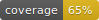

# ColliderML

[](https://github.com/OpenDataDetector/ColliderML/actions/workflows/tests.yml)

[](https://www.python.org/downloads/)
[](https://opensource.org/licenses/MIT)

A modern machine learning library for high-energy physics data analysis.

## Installation

```bash
pip install colliderml                 # core + Polars loader + unified load()
pip install 'colliderml[sim]'          # local simulation (needs Docker/Podman)
pip install 'colliderml[remote]'       # SaaS backend client
pip install 'colliderml[tasks]'        # benchmark task reference baselines
pip install 'colliderml[all]'          # everything above + dev tools
```

For development: `pip install -e ".[dev]"`

## Getting the data

**Option 1 — Python one-liner (downloads on first call, then caches):**

```python
import colliderml

frames = colliderml.load("ttbar_pu0", max_events=200)
print(frames["particles"])             # Polars DataFrame
```

**Option 2 — CLI (explicit download, then load with the library):**

```bash
colliderml download --channels ttbar --pileup pu0 --objects particles,tracker_hits,calo_hits,tracks --max-events 200
```

Cache location: default `~/.cache/colliderml`, or set `COLLIDERML_DATA_DIR`. List downloaded configs: `colliderml list-configs`.

**Option 3 — HuggingFace only:**

```python
from datasets import load_dataset
dataset = load_dataset("CERN/ColliderML-Release-1", "ttbar_pu0_particles", split="train")
```

## Running simulations

New in v0.4.0: generate events yourself with the full ODD pipeline, either locally in a container or via the SaaS backend.

```python
import colliderml

# Local: runs inside the OpenDataDetector software container.
# Needs Docker or Podman; the `[sim]` extra provides the driver.
result = colliderml.simulate(preset="ttbar-quick")
print(result.run_dir)                  # parquet outputs land here

# Remote: submit to the SaaS backend (requires an HF token).
# The `[remote]` extra pulls in requests; no container runtime needed.
result = colliderml.simulate(preset="higgs-portal-quick", remote=True)
print(result.remote_request_id)
```

CLI equivalents:

```bash
colliderml list-presets
colliderml simulate --preset ttbar-quick --local
colliderml simulate --preset higgs-portal-quick --remote
colliderml status <request-id>
colliderml balance
```

See the [Local Simulation](https://opendatadetector.github.io/ColliderML/guide/simulation) and [Remote Simulation](https://opendatadetector.github.io/ColliderML/guide/remote-simulation) guides for details.

## Benchmark tasks

New in v0.4.0: six built-in benchmark tasks — `tracking`, `jets`, `anomaly`, `tracking_latency`, `tracking_small`, and `data_loading` — with a unified registry and a leaderboard backed by the SaaS backend.

```python
import colliderml.tasks

print(colliderml.tasks.list_tasks())
scores = colliderml.tasks.evaluate("tracking", "my_preds.parquet")
colliderml.tasks.submit("tracking", "my_preds.parquet")   # earn credits on new bests
```

Reference baselines (scikit-learn for BDT/IsoForest) ship with the `[tasks]` extra. See the [Benchmark Tasks guide](https://opendatadetector.github.io/ColliderML/guide/tasks) for details.

## Using the library

The notebook [notebooks/colliderml_loader_exploration.ipynb](notebooks/colliderml_loader_exploration.ipynb) shows the data-loading and analysis helpers: `load_tables`, exploding event tables, pileup subsampling, calibration, and plotting.

Full docs: <https://opendatadetector.github.io/ColliderML>

## Development

```bash
pytest -v -m "not integration"
```

Docs are built with VitePress: `npm ci --prefix docs && npm run --prefix docs docs:build`.

## License

[MIT License](LICENSE)
